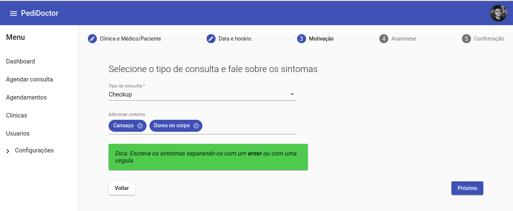
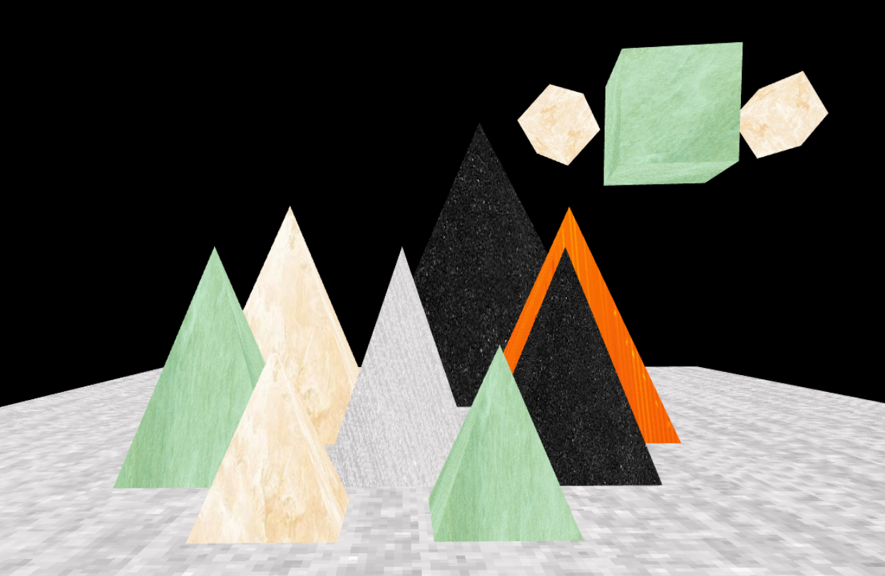
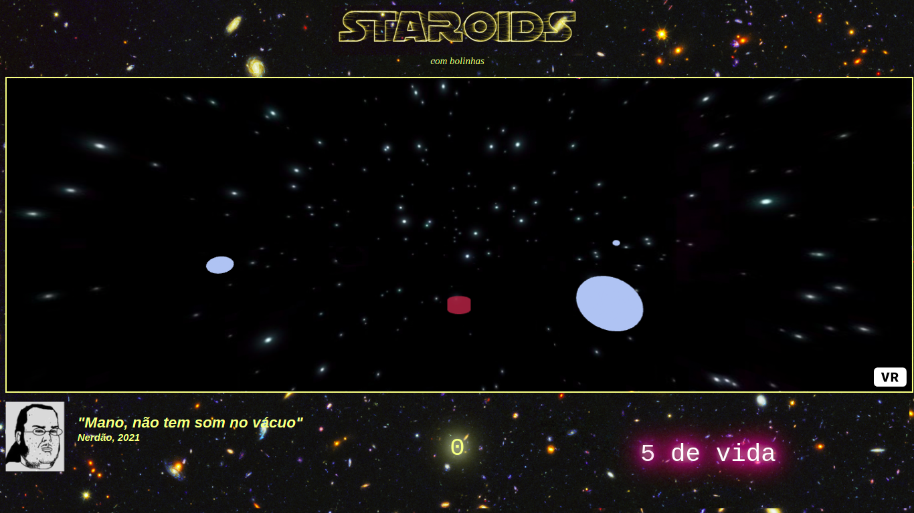
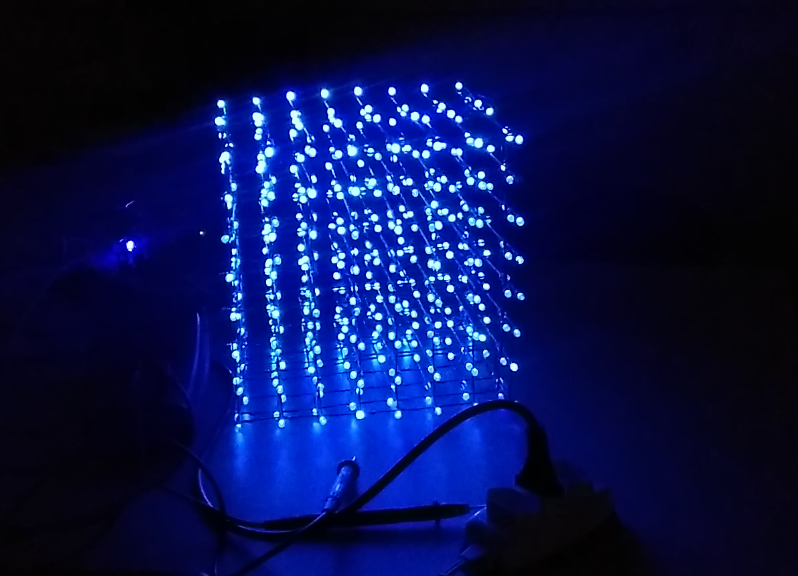
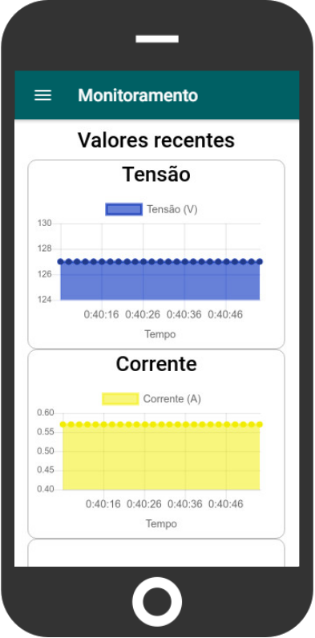
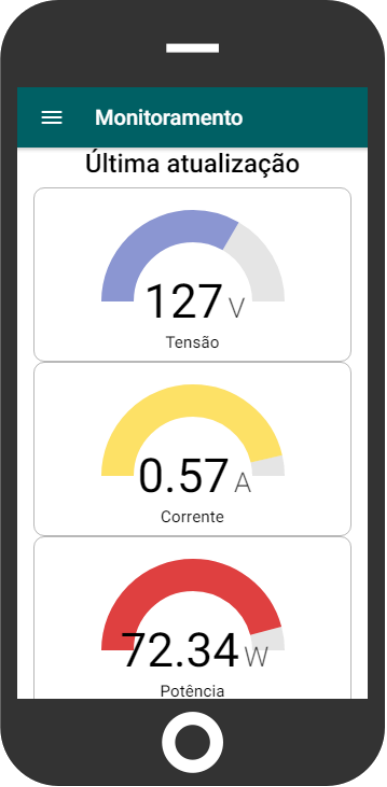
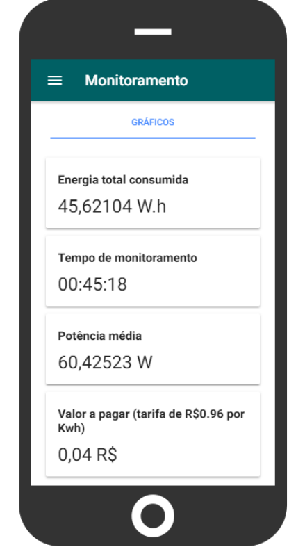

# André Neves

<table>
<td></td>
<td>
Senior software engineer with 7+ years of experience, specialized in frontend development with strong full-stack capabilities. Strong expertise in Angular, TypeScript, and frontend architecture, with complementary experience in Node.js, Java/Spring Boot, PHP, database optimization, and DevOps practices.

- Led the migration of 10 enterprise projects from Angular 12 to 16, demonstrating strong frontend leadership;
- Implemented a design system oriented by the Atomic Design Methodology, improving the Developer Experience (DX);
- Developed full-stack solutions using Node.js/Nest.js, Java/Spring Boot, and PHP;
- Achieved 99% performance improvement through MongoDB query optimization and strategic database indexing;
- Participated in technical decisions about database structuring and API design patterns;
- Led architecture decisions using Clean Architecture and SOLID principles;
- Implemented CI/CD pipelines and DevOps practices with Docker and Nginx;
- Collaborated to fix more than 30 bugs that were critical to user experience;
- Collaborated to hire developers and coached a junior developer in his first IT experience.
</td>
</table>

# 🛠️ Skills

- Programming languages: Javascript, Typescript, Java, PHP, Dart
- Frontend (Primary Focus): Angular, Ionic, Flutter, TypeScript
- Full-Stack & Backend: Node.js, Nest.js, Java/Spring Boot, PHP
- Databases: MongoDB, MySQL, PostgreSQL, Oracle (with optimization expertise)
- Architecture & Design: Clean Architecture, Domain-Driven Design, System Design
- DevOps: Docker, Nginx, CI/CD, Infrastructure as Code

# 💬 Contact

<ul>
    <li>
        

             Linkedin: <a href="https://www.linkedin.com/in/andre-neves-dev/">https://www.linkedin.com/in/andre-neves-dev/</a>
        

    </li>
    <li>
        

             GitHub: <a href="https://github.com/AndreNeves97/">https://github.com/AndreNeves97/</a>
        

    </li>
</ul>

# Other profile pages

- Passei direto: [https://www.passeidireto.com/perfil/330404-andre-neves/](https://www.passeidireto.com/perfil/330404-andre-neves/)

# 👨🏻‍💻 Projects

## [Github Search (Angular)](https://github.com/AndreNeves97/github-search-angular)

Angular WebApp that consumes the Github API to search users. More information at the [README.md](https://github.com/AndreNeves97/github-search-angular#readme) file.
- [Source code](https://github.com/AndreNeves97/github-search-angular)
- [Public link](https://github-search-f7f52.web.app/)

## [Personal finances app (Flutter)](https://github.com/AndreNeves97/personal-finances-app-flutter)

Flutter App to organize personal finances.

- [Source code](https://github.com/AndreNeves97/personal-finances-app-flutter)

## [Node.js advanced concepts showcase](https://github.com/AndreNeves97/nodejs-advanced-concepts)

A small project with some of the main advanced concepts in Node.js, such as event-emitter, streams, and buffers.

- [Source code](https://github.com/AndreNeves97/nodejs-advanced-concepts)

## [Node.js notifications service](https://github.com/AndreNeves97/notifications-service-nestjs)

Nest.js microservice to manage notifications sending.
- [Source code](https://github.com/AndreNeves97/notifications-service-nestjs)

## Others
- [Two-player Drench Game via Peer-to-Peer connection (Flutter)](#jogo-drench-em-flutter)
- [Anatome - Mobile App to teach Anatomy (Flutter)](https://github.com/anatome-a11y/app_flutter)
- [Pedidoctor - Medical appointment scheduling system (Angular)](#pedidoctor)
- [Graphic implementation for Knight's tour backtracking algorithm (Ionic/Angular)](https://github.com/AndreNeves97/knights-tour-algorithm)

# 📚 College subjects

- [Linear Algebra](#álgebra-linear)
- [Algorithms and Data Structures](#algoritmos-e-estruturas-de-dados)
- [Computer Organization and Architecture](#arquitetura-e-organização-de-computadores)
- [Databases](#banco-de-dados)
- [Compilers](#compiladores)
- [Computer Graphics](#computação-gráfica)
- [Software Engineering](#engenharia-de-software)
- [Artificial Intelligence](#inteligência-artifical)
- [Distributed Systems](#sistemas-distribuídos)
- [Microprocessors and microcontrollers](#microprocessadores-e-microcontroladores)
- [Concurrent computing](#programação-concorrente)

## Algoritmos e estruturas de dados

- [Resolução de problemas com programação dinâmica](https://github.com/AndreNeves97/AndreNeves97/blob/master/portfolio/academic-papers/AED/resolucao-de-problemas-com-programacao-dinamica.pdf)

- [Explicação da resolução do problema: Desmascarando o Empregado do Sultão](https://github.com/AndreNeves97/AndreNeves97/blob/master/portfolio/academic-papers/AED/explicacao-problema-desmascarando-empregado-do-sultao.pdf)

- [Implementação gráfica do algoritmo de backtracking para o problema Knight's tour](https://github.com/AndreNeves97/knights-tour-algorithm)

## Arquitetura e organização de computadores

- [Pipeline e Hierarquia de memória](https://github.com/AndreNeves97/AndreNeves97/blob/master/portfolio/academic-papers/AOC/arquitetura-organizacao-computadores-pipeline-hierarquia-de-memoria.pdf)

- [Resumo - The RISC Penalty](https://github.com/AndreNeves97/AndreNeves97/blob/master/portfolio/academic-papers/AOC/resumo-the-RISC-penalty.pdf)

## Compiladores

Na disciplina de compiladores, foram propostos dois trabalhos: Um analisador léxico para a linguagem ANSI-C, e um analisador sintático para HTML.

Acesse os projetos pelos links abaixo. 

- [Compilador para HTML (Analisador léxico e sintático)](https://github.com/AndreNeves97/html-compiler)
- [Compilador para linguagem C (Analisador léxico)](https://github.com/AndreNeves97/c-lexical-compiler) 

## Inteligência artifical

- [Implementações de algoritmos genéticos - FGA e NSGA](https://github.com/AndreNeves97/genetic-algorithm)
- [Implementações de redes neurais - Perceptron simples e MLP](https://github.com/AndreNeves97/neural-network)

## Programação concorrente

- [Clusterizção  de  grafos  pelo  algoritmo K-Medoids comutilização  de  multiplas threads](https://github.com/AndreNeves97/AndreNeves97/blob/master/portfolio/academic-papers/PC/clusterizacao-de-grafos-algoritmo-k-Medoids-multiplas-threads.pdf)

## Álgebra linear

- [Conjuntos Convexos e Programação Linear](https://github.com/AndreNeves97/AndreNeves97/blob/master/portfolio/academic-papers/AL/algebra-linear-programacao-linear.pdf)

## Banco de dados

- [Bancos de dados NoSQL](https://github.com/AndreNeves97/AndreNeves97/blob/master/portfolio/academic-papers/BD/bancos-de-dados-NoSQL.pdf)

## Engenharia de software

### Seminário sobre DevOps

- [DevOps e Ambientes de Execução de Software](https://github.com/AndreNeves97/AndreNeves97/blob/master/portfolio/academic-papers/ES/devOps-e-ambientes-de-execucao-de-software.pdf)

### Pedidoctor

Pedidoctor foi um projeto desenvolvido na disciplina de Engenharia de Software. O sistema tem como objetivo centralizar a marcação de consultas para diferentes clínicas médicas

Mais informações e códigos:
- [Frontend - Angular](https://github.com/AndreNeves97/pedidoctor-angular)
- [Backend - Node.js / Nest.js](https://github.com/AndreNeves97/pedidoctor-nodejs)

Documentações:
- [Documentação de desenvolvimento de projeto de software](https://github.com/AndreNeves97/AndreNeves97/blob/master/portfolio/academic-papers/ES/documentacao-de-software-pedidoctor.pdf)
- [Trabalho prático de Teste de Software](https://github.com/AndreNeves97/AndreNeves97/blob/master/portfolio/academic-papers/ES/teste-de-software.pdf)

## Sistemas distribuídos

### Jogo Drench em Flutter

Esse projeto foi parte de um trabalho da disciplina de sistemas distribuídos.

Contém a implementação do jogo Drench no modo multiplayer. O objetivo foi implementar uma comunicação entre dois dispositivos via Sockets sobre os protocolos TCP, UDP e gRPC. No momento de estabelecer a conexão, o usuário escolhe qual método utilizar

Mais informações e código: [https://github.com/AndreNeves97/drench-sd-flutter](https://github.com/AndreNeves97/drench-sd-flutter)

Artigos sobre o trabalho:
- [Comunicação multiplayer com TCP e UDP](https://github.com/AndreNeves97/AndreNeves97/blob/master/portfolio/academic-papers/SD/SD-Comunicacao-entre-processos-com-TCP-e-UDP.pdf)
- [Comunicação multiplayer com gRPC](https://github.com/AndreNeves97/AndreNeves97/blob/master/portfolio/academic-papers/SD/SD-Comunicacao-entre-processos-com-gRPC.pdf)

Vídeo com demosntração do jogo em funcionamento multiplayer: [https://www.youtube.com/watch?v=d5h8v_d_-H8](https://www.youtube.com/watch?v=d5h8v_d_-H8)

### Chat Peer-to-Peer

Desenvolvimento de um chat com multiplos usuários conectados ponta-a-ponta.

Mais informações e código: [https://github.com/AndreNeves97/node-p2p-chat](https://github.com/AndreNeves97/node-p2p-chat)

Vídeo de demosntração: [https://www.youtube.com/watch?v=fsdCOiBw28w](https://www.youtube.com/watch?v=fsdCOiBw28w)

## Computação gráfica

Disciplina com foco nos conceitos fundamentais de computação gráfica. Como complementação ao conteúdo teóriico, foram feitos trabalhos práticos em WebGL e A-Frame

- [Introdução à Computação Gráfica com WebGL](https://andreneves97.github.io/computer-graphics/public/)
- [Jogo *Asteroids* desenvolvido em Javascript e A-Frame](https://leonamtv.github.io/cg-aframe/public/studies/tests-1/animation/)

## Microprocessadores e microcontroladores

Nessa disciplina, houve aprofundamento sobre arquitetura de computadores, junto à prática de atividades com microcontroladores.

### Cubo de led

Um dos trabalhos foi o desenvolvimento de um Cubo de led 8x8x8.

Imagens, vídeos e códigos: [https://github.com/AndreNeves97/Cubo-de-led-8x8x8](https://github.com/AndreNeves97/Cubo-de-led-8x8x8)

### Protótipo de monitoramento de consumo de energia elétrica via Web

Esse foi um trabalho desenvolvido antes da disciplina, mas orientado pelo mesmo professor.

Teve como objetivo o desenvolvimento de um protótipo para acompanhamento do consumo de energia elétrica via Web, pelo celular e computador.

<table>
    <tr>
        <td>
            
        </td>
        <td>
            
        </td>
        <td>
            
        </td>
    </tr>
</table>
