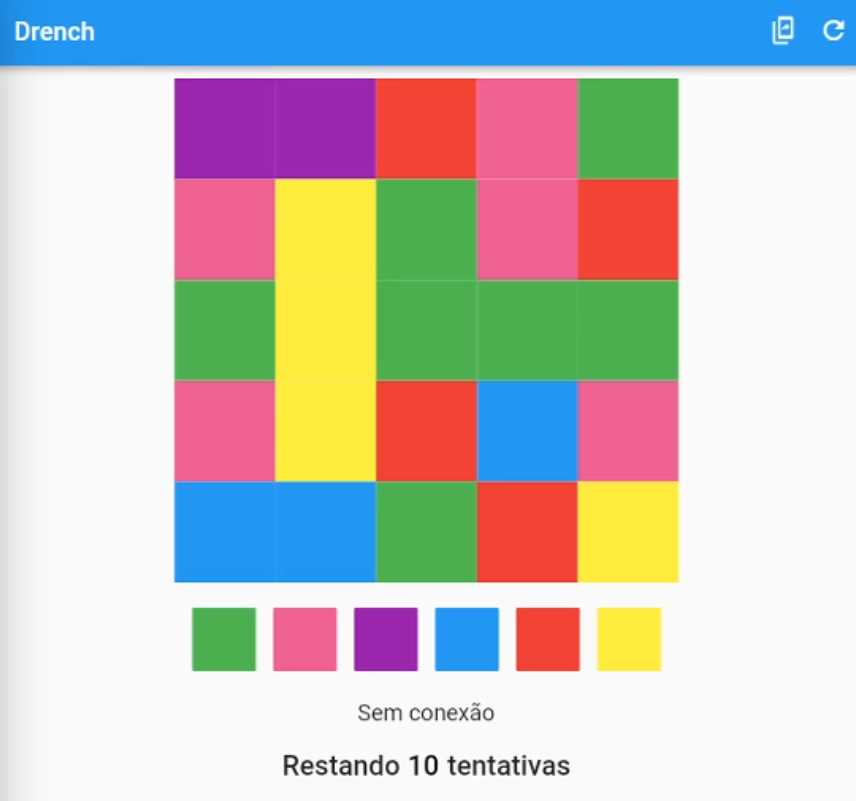
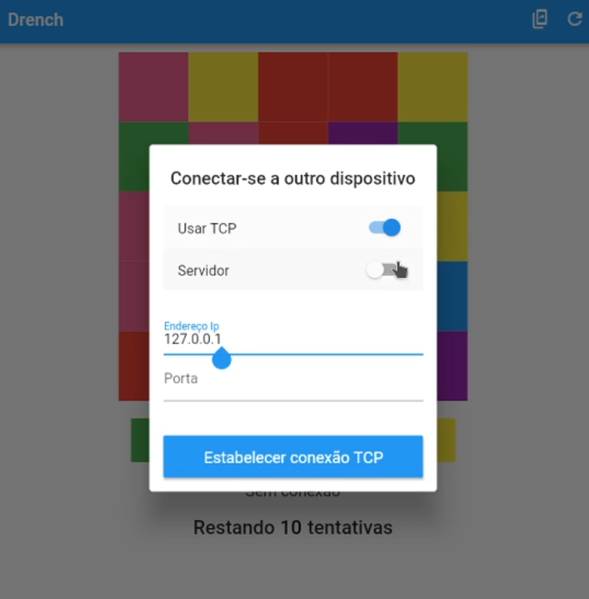
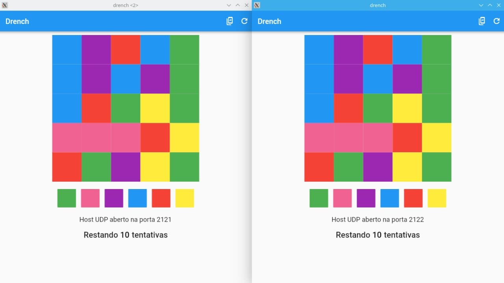

# Meu portfólio

Abaixo listo meus principais projetos de software e projetos acadêmicos.

## Aplicativos mobile e web apps

- [Anatome - Aplicativo para ensino de anatomia](https://github.com/AndreNeves97/app_flutter)
- [Jogo Drench em Flutter para dois jogadores via conexão Peer-to-Peer](#jogo-drench-em-flutter)
- Pedidoctor - Sistema para marcação de consultas em diferentes clínicas médicas
  - [Frontend - Angular](https://github.com/AndreNeves97/pedidoctor-angular)
  - [Backend - Node.js / Nest.js](https://github.com/AndreNeves97/pedidoctor-nodejs)

## Projetos acadêmicos

- [Compilador para HTML (Analisador léxico e sintático)](https://github.com/AndreNeves97/html-compiler) - Desenvolvido em Python
- [Compilador para linguagem C (Analisador léxico)](https://github.com/AndreNeves97/c-lexical-compiler) - Desenvolvido em Python
- [Introdução à Computação Gráfica com WebGL](https://github.com/AndreNeves97/computer-graphics)
- [Jogo *Asteroids* desenvolvido em Javascript e A-Frame](https://github.com/leonamtv/cg-aframe)
- [Chat Peer-to-Peer com Node.js](https://github.com/AndreNeves97/node-p2p-chat)
- [Implementações de algoritmos genéticos - FGA e NSGA](https://github.com/AndreNeves97/genetic-algorithm)
- [Implementações de redes neurais - Perceptron simples e MLP](https://github.com/AndreNeves97/neural-network)
- [Implementação gráfica do algoritmo de backtracking para o problema Knight's tour](https://github.com/AndreNeves97/knights-tour-algorithm)

# Exposição dos projetos

## Jogo Drench em Flutter

Esse projeto foi parte de um trabalho da disciplina de sistemas distribuídos.

Contém a implementação do jogo Drench no modo multiplayer. O objetivo foi implementar uma comunicação entre dois dispositivos via Sockets sobre os protocolos TCP e UDP.

Mais informações e código: https://github.com/leonamtv/drench-sd

Vídeo com demosntração do jogo em funcionamento multiplayer: https://www.youtube.com/watch?v=d5h8v_d_-H8

### Imagens

<table>
    <td>
        
    </td>
    <td>
        
    </td>
</table>

### Video

Vídeo com demonstração do jogo em funcionamento multiplayer: https://www.youtube.com/watch?v=d5h8v_d_-H8

